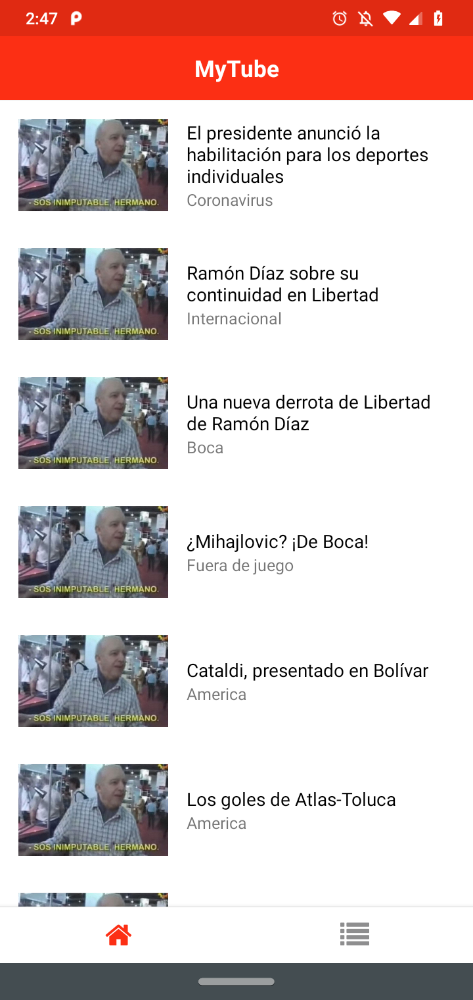
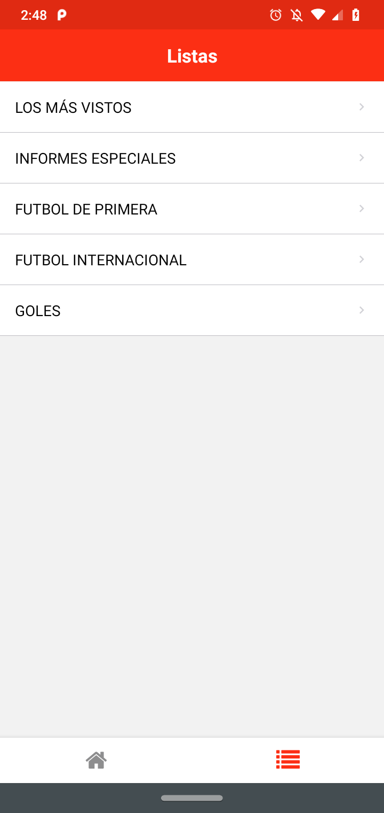
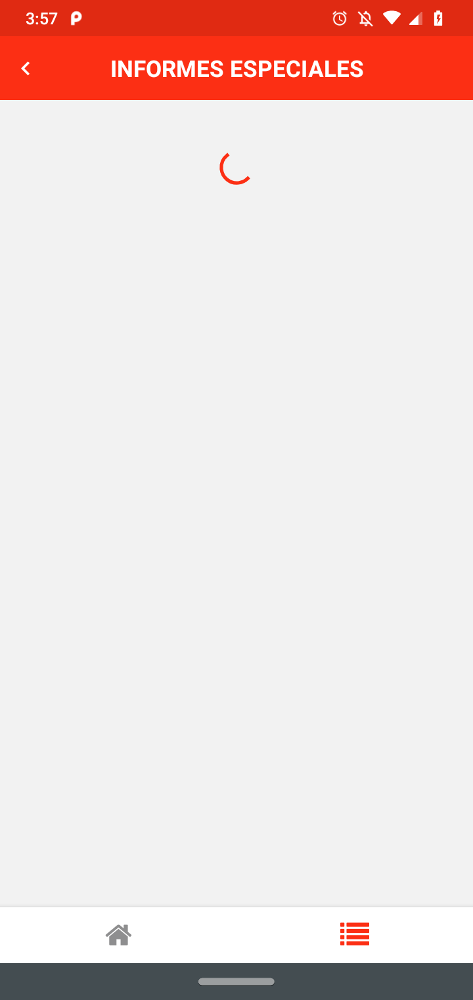
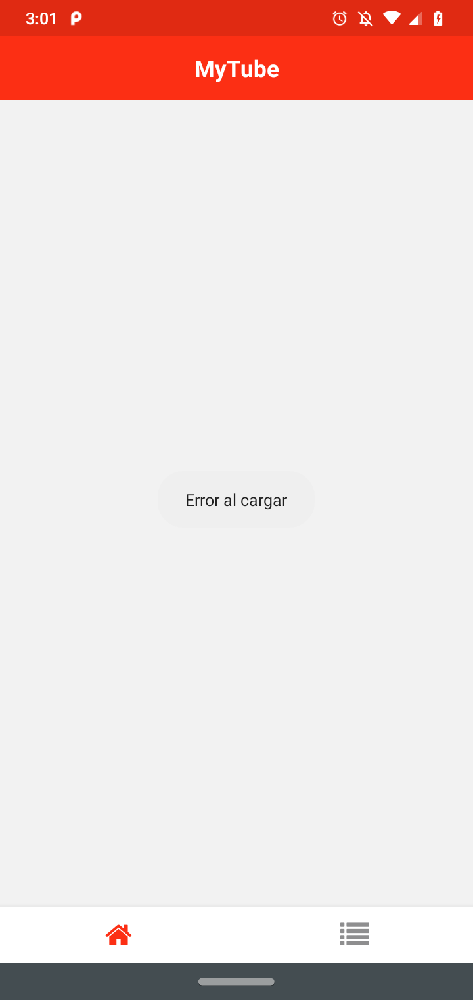
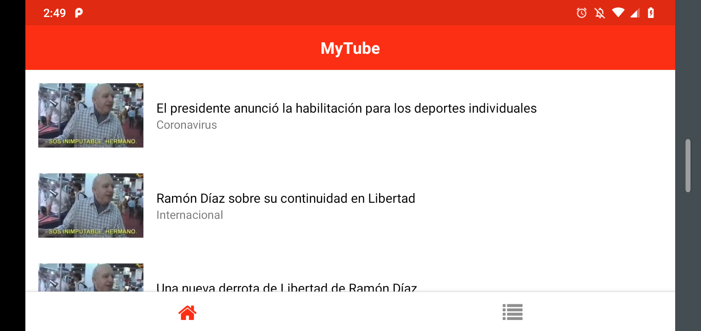
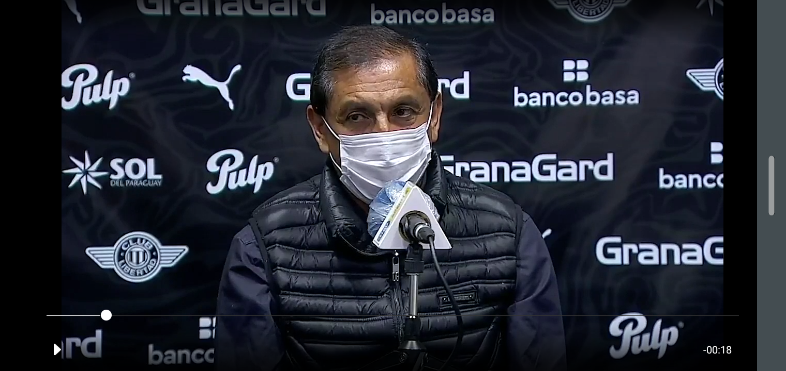

# Flujo y uso

Acá se detalla un poco el flujo de la aplicación y temas sobre el uso de la misma.

## Pantallas principales

Como bien dice en el [readme](../README.md), la principal función de esta aplicación es la de ver
videos. En definitiva para esto se cuenta con tres tipos de pantallas:

- **Home**: en este tipo de pantalla se enlistan los videos de Home. Por cada video se muestra un
  thumbnail, el título y el subtítulo (categoría) del mismo.
  Al apretar sobre uno se va a abrir la pantalla de video.

  

- **Listas**: en esta se muestra un listado de las listas principales, al seleccionar una de estas se
  pasa a mostrar los videos pertenecientes a la seleccionada. Esta última pantalla tiene el mismo
  comportamiento que la de Home, la única diferencia es que en el header se muestra el nombre de la
  lista que se está viendo.

  
  

- **Video**: esta última pantalla es la de reproducción del video seleccionado. Inicia con el video
  reproduciendose y se puede pausar tocando en cualquier parte de la pantalla. También muestra el
  tiempo total y el usuario se puede ir moviendo a distintas partes del mismo con la barra del
  progreso.

  

Las pantallas de listados de video cuentan con *pull to refresh* y *scroll infinito*.

## Otras pantallas

Como en toda aplicación que obtiene información desde una api, hace falta tener en consideración
ciertos casos para manejar. En este caso se tomaron en cuenta los siguientes:

- **Loading**: ya que las request al back para traer los datos a mostrar pueden tardar en las pantallas
  de listas de video se muestra un spinner hasta que se obtenga una respuesta.

  

- **Sin datos**: también pude suceder que no haya videos o listas a mostrar, en estos casos entonces se
  muestra una pantalla con un "No hay videos :(" o "No hay listas :(", según sea el caso
  correspondiente.

  

- **Error**: cuando la request falla se muestra un Toast en el medio de la pantalla que dice "Error al
  cargar".

  

## Orientación landscape

Si bien hasta ahora se mostraron imagenes de la aplicación siendo usada con la orientación Portrait
del teléfono, esta misma también funciona con una orientación Landscape.
La funcionalidad sigue siendo la misma.

  
  

## Gestos y animación

Ciertas pantallas se abren teniendo una animación apareciendo horizontalmente de derecha a
izquierda. Estas mismas pantallas pueden ser cerradas haciendo un gesto contrario, esto es,
deslizando horizontalmente de izquierda a derecha.

